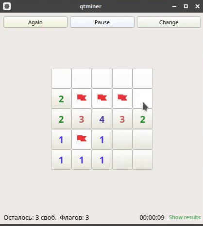

# QtMiner

 

**The best implementation of the famous game!** 

Игра Сапёр на Qt с хранением результатов предыдущих игры в базе данных PostgreSQL.

# Использование

При запуске приложения открывается окно с игровым полем и меню. При первом нажатии на клетку поля, генерируется карта с заданными размерами и количеством мин (по умолчанию — карта 9x9 с 10-ю минами) и запускается таймер. Установка / снятие флага на клетку осуществляется нажатием правой кнопки мыши. При нажатии на ячейку из пустой области происходит отображение всей пустой области. В процессе игры выводится информация о количестве свободных клеток и доступных флагов, а также время текущей игры. 

<!-- For getting json http://vimeo.com/api/v2/video/ + video_id + .json -->
<p align="center">
  <a href="https://vimeo.com/356858685" target="_blank">
    
  </a>
</p>

Пользователь может перезапустить текущую игру, поставить её на паузу или изменить характеристики игрового поля.

<p align="center">
  
</p>

По нажатию на кнопку `Show results` открывается диалоговое окно с результатами предыдущих игр с характеристиками игрового поля равными текущим.

<p align="center">
  
</p>

# Установка
## Сборка

1. Установите Qt:
     - [`Ubuntu`](https://wiki.qt.io/Install_Qt_5_on_Ubuntu);
     - [`Arch`](https://www.archlinux.org/packages/extra/x86_64/qt5-base/);
     - [`Windows`](https://www.qt.io/download).

2. Для сборки необходимо перейти в корневой каталог проекта и выполнить команду:
    ```sh
    qmake && make
    # or
    qmake && make -j4 # for multicore
    ```

## Настройка базы данных

1. Для работы с базой данных вам необходимо установить [PostgreSQL Core Distribution](https://www.postgresql.org/download/):

      - [`Ubuntu`](https://timeweb.com/ru/community/articles/kak-ustanovit-postgresql-na-ubuntu-18-04-1);
      - [`Arch`](https://wiki.archlinux.org/index.php/PostgreSQL_(%D0%A0%D1%83%D1%81%D1%81%D0%BA%D0%B8%D0%B9));
      - [`Windows`](https://www.postgresql.org/download/windows/).

2. Далее необходимо запустить сервер PostgreSQL:
      - Ubuntu:
        ```sh
        # start the PostgreSQL server
        $ sudo service postgresql start

        # stop the PostgreSQL server
        $ sudo service postgresql stop
        ```
      - Arch:
        ```sh
        # start the PostgreSQL server
        $ systemctl start postgresql

        # check if it started
        $ systemctl status postgresql

        # add to startup
        $ systemctl enable postgresql

        # stop the PostgreSQL server
        $ systemctl stop postgresql
        ```
      - Windows:
        ```sh
        # start the PostgreSQL server
        pg_ctl -D "C:\Program Files\PostgreSQL\9.6\data" start

        # stop the PostgreSQL server
        pg_ctl -D "C:\Program Files\PostgreSQL\9.6\data" stop
        ```

3. Создание пользователя qtminer и базы даных:
   - Linux: 
        ```sh
        $ sudo -u postgres createuser qtminer # create user

        $ sudo -u postgres psql # change password
        ALTER USER qtminer WITH encrypted PASSWORD '123456';

        $ sudo -u postgres createdb -O qtminer qtminer # create db
        ```
    - Windows: 
        ```cmd
        REM connect to the DB server as the Postgres super user using the psql command
        psql -h <host_Name> -U <super_username> -d postgres

        REM create user and database
        create user qtminer password '123456' ;
        create database "qtminer" with owner qtminer;
        ```

4. Для создания таблицы в базе данных для хранения результатов игр используется `createDB`. Для его сборки необходимо перейти в директорию [`src/Results/createDB/`](./src/Results/createDB/) и выполнить:

    ```sh
    qmake && make
    # or
    qmake && make -j4 # for multicore
    ```

Настройки подключения к базе данных хранятся в конфигурационном файле [`src/Results/connection/config`](./src/Results/connection/config).


